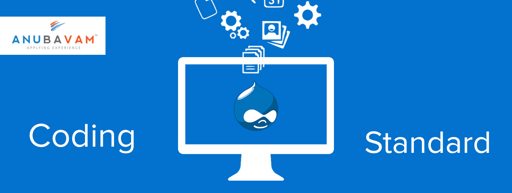
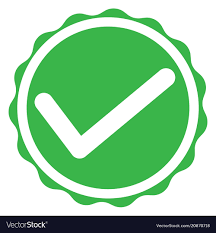

## The Backbone of Programming

The backbone of programming in my humble opinion is coding standards. It is literally and figuratively the backbone. It is literally the backbone because it provides the structure of the entire code and it is the thing that holds the code up. It is figuratively the backbone because it is one of the most important things when it comes to programming because it improves the quality of code by invoking a certain criteria that the code needs to meet in order for the programmer and others to understand it. Coding standards is also effective in helping when you are familiarizing yourself with a new language. It provides a set structure for you as a programmer to use in order for you to learn what each command does. For example, coding standards help when dealing with loops because it clearly shows what is inside and outside of the loop so that you do not get confused about anything in that regard. That is why coding standards are an essential part of programming.

## Impression of ESLint & IntelliJ

After trying out IntelliJ with ESLint for the first time in my life, I can safely say that ESLint is definitely a helpful tool in IntelliJ that helps me figure out what and where I have made mistakes in my code. Personally, I find it very rewarding when I get the green checkmark from ESLint which tells me that there are no significant errors in my code, unless I made a semantic one. This is very helpful for someone like me, especially since I am not the best at spotting out small errors like that, especially when there are larger amounts of code. The green checkmark is definitely something you have to work for, and although it might be painful sometimes, it is all worth it in the end when you receive the green checkmark because it shows that you were able to fix the mistakes that you made.
