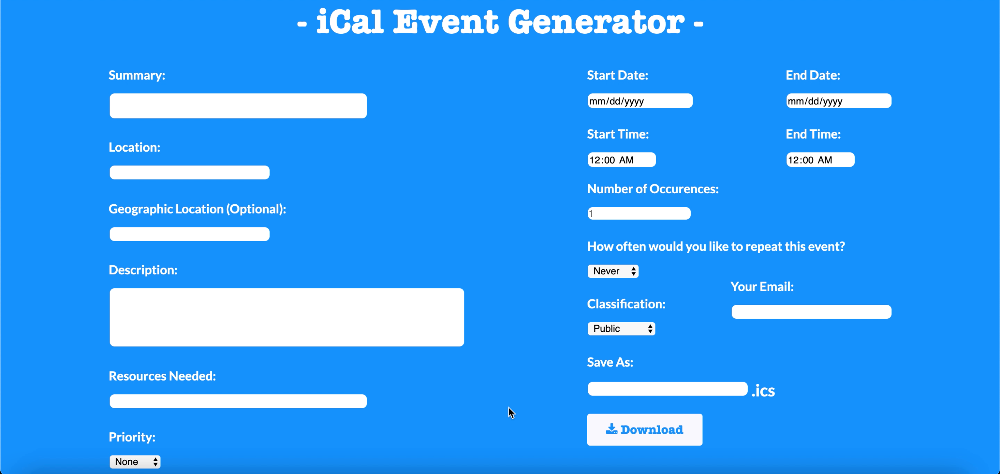

In my ICS 414 class, we made a local web application that was an event planner. It allows users to create events and generate .ics files that users can open with 
their calendar. With these events that are created, users have many different fields that they can input into. We allows user the simple basic features such as 
the summary field, description field, location field, start & end date & time, and allowing you to save the event & download it as an .ics file. Other features 
that we have in our event planner is geographic location, priority of event, repitition of events, classification, and adding in your email. All of these features 
combine to form Team Pickled Beans's iCal Event Generator.

For this project, the main parts that I worked on were the user input aspects, regex, and repitition of events. For the user input aspects, I worked on most of 
the fields that users had to input in such as the description, summary, location, and resources needed. Those are relatively simple as we just have text areas 
for users to type in. I also worked on the regex sections where we filtered out things that users could and could not enter to make sure they only enter valid 
information. The repitition of events were also made so that users can have repetitive events and they can also decide how much times they want the event to 
repeat.

Overall, from this experience, what I gained was the knowledge of making an event planner. It is a useful thing to know as event planners are something that is 
used in everyday life so by coding our own version of it, our team was able to learn how to create and use the features that we were able to create. We are 
essentially reverse engineering the event generator in order to get a better understanding of how it all works. That way, it makes the user experience for 
ourselves better as we know how the code works so we can in turn understand the usability of the event planner. 

