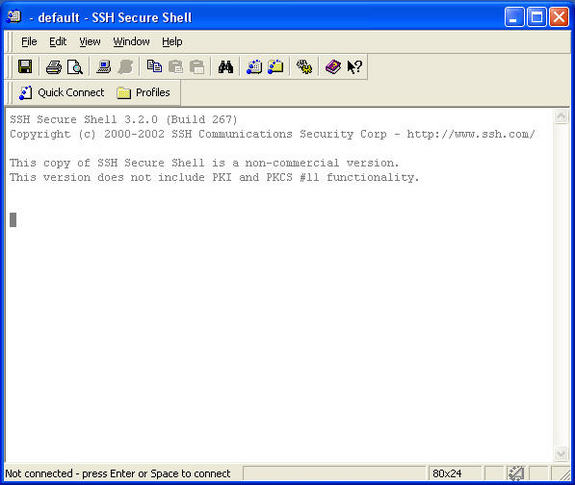
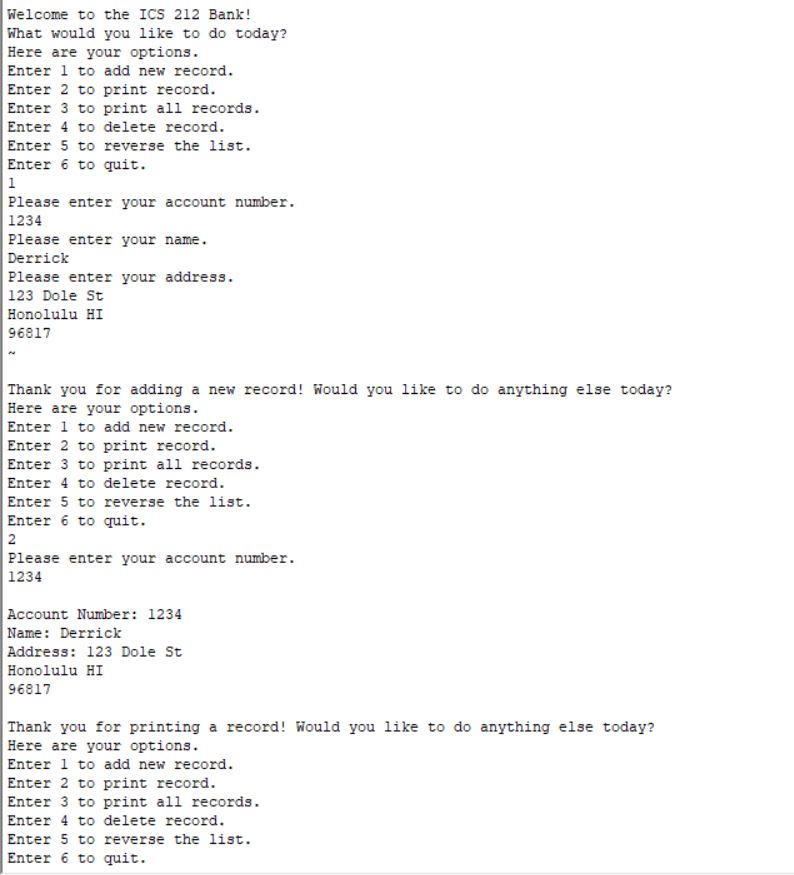

In my ICS 212 class, which was about Program Structure, I programmed a simple bank database. It displays a menu that asks the user for input. They could do one of the following: add a new record, print a record, print all records, delete a record, reverse the list of records, or quit the program. The reverse the list option was just an addition feature that was added into the program to add a small twist to it. 

In this project, it was a solo activity so I did all the coding myself. First of all, I wrote a bunch of pseudocode to help me plan this project out. Even though it was just a small bank database, the code itself was still a big chunk. I had to write pseudocode to plan out everything and make sure that I accounted for all cases. After that, I just translated that into code and while there were a few kinks at first, it all worked out in the end. 

Overall, from this experience, I learned how to code a simple bank database in C. I also had to code it in C++ as well but most of it was similar to C so it was just converting the C code to C++. I also learned how to be very meticulous when it comes to coding because every detail down to the smallest bit has to be one hundred percent correct. Otherwise, if that one bit is wrong, then the code will be one hundred percent wrong. It also taught me how to read my own code and look for errors that I made. I used SSH Secure Shell to code my database and that does not have the syntax checking like other programs like Eclipse or IntelliJ have so it was difficult to find those errors. However, I came out of it and I can say that I am proud of my bank database. Here is what it looks like: 

