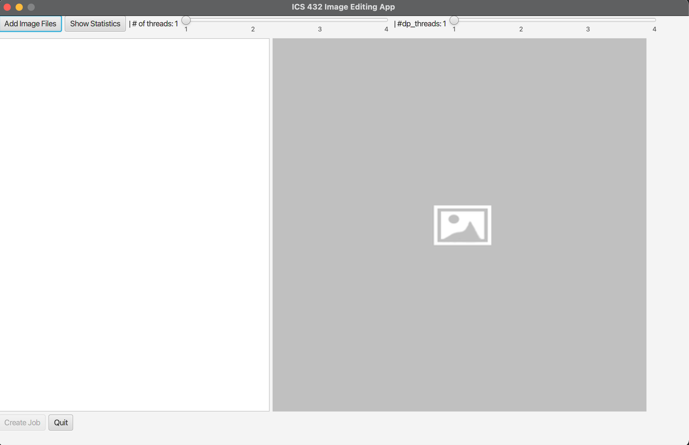

In my ICS 432 class, I was part of Team 11 and together, we added new features, fixed bugs, and enhanced certain features in an existing base image processing app. 
Originally, the app was created by our professor, Henri Casanova, as a base project that we were to modify throughout the semester in order to apply the concepts we 
learned throughout the course. The various features that we were to add included adding total execution times to the job window, unfreezing the application, adding 
a cancel button for jobs as well as a progress bar, adding a display windows for statistics of the various jobs, multithreading all jobs, controlling memory 
footprint, using an array-blocking queue for producer-consumer setup, sharing one producer-consumer setup throughout the whole program, data and task parallelism, 
and adding our own Median and Data Parallel Mediam filters.

For this project, all three members of the team (decreased to two mid-semester) had a part in every part of the project from writing the actual source code to 
writing test code to cover majority of the code. We all worked on every feature in our own branches and at the end of each assignment, we just chose one branch 
to push into our main repository as the representative. The reason why we did this was to give everyone a chance to work on all aspects, thus giving all members a 
chance to work on and understand every part of our source code. This helped to provide a good way to apply the concepts we were learning in class to an actual 
project as opposed to just the learning part.

Overall, from this experience, what I gained was the knowledge of multi-threading and concurrency and how that all works. I learned how to implement locks, 
producer-consumer setup, task and data parallelism, and more. The semester-long project served as a good application of the concepts we learned throughout classes. 
It really helps enforce the ideas that we learn when you are able to be more hands-on and actually code what you are learning. You learn to understand how it works 
and from there, you slowly build your knowledge up. The class and the project overall was a great experience and I gained a lot from it.

All work related to this project is located here at [this repository](https://github.com/gumsanaung/ics432imgapp). However, the repository is private as per the 
instruction of the professor so you would like to request to see it, please email me at derrickluyen1@gmail.com.

