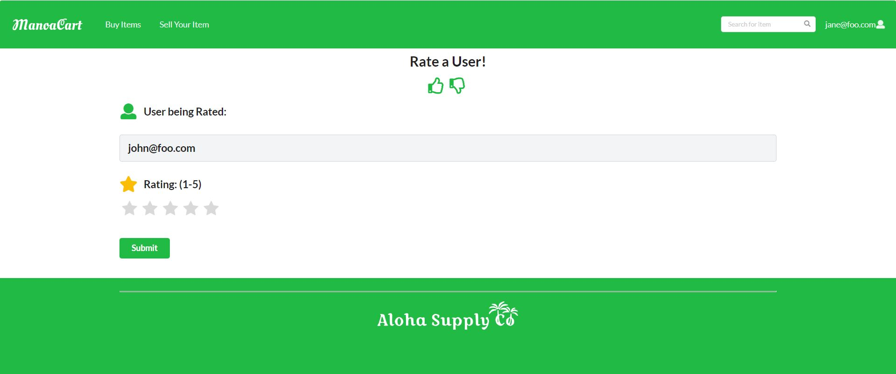
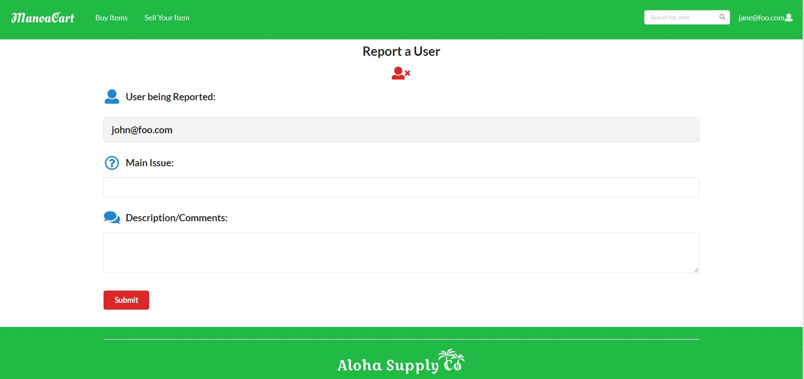

In my ICS 314 class, we made a web application and we chose to make ours imitate a flea market of sorts. Our project was called ManoaCart and it was made by the organization that I am a part of, [Aloha Supply Co](https://aloha-supply-co.github.io/). Our [web application](http://manoacart.meteorapp.com/) is basically a website where you can buy and sell items between other members of the UH Manoa community. You can also rate and report users as you please if you have something to say about them. It is a basic flea market type of website that allows users a cheaper alternative to the UH Manoa Bookstore.

For this project, the main parts that I worked on were the ratings page and the report user page. You can access these pages when you are trying to buy an item from a seller. There are buttons on that page that allows you to rate the seller and report the seller. For the ratings page, you will be greeted with a form that displays the name of the seller you are rating and then asks for a rating that you would like to give to the user. For the report user page, you will again be greeted with a form that displays the name of the seller you are reporting. There will also be two text fields that need to be filled in: Main Issue and Description/Comments. This is basically asking for you to type what is wrong with this user and then explain more about it. 

Overall, from this experience, what I gained was the knowledge of how to code a working web application. It was definitely challenging at first when I was trying to figure everything out, but over time, I got used to it and had fun as well. I also learned how to work together as a team for a somewhat bigger scale project. The code itself had a lot of lines so we had to be able to divide everythin up evenly to the best of our abilities and I think we did a good job with that and with the application itself as well. 

