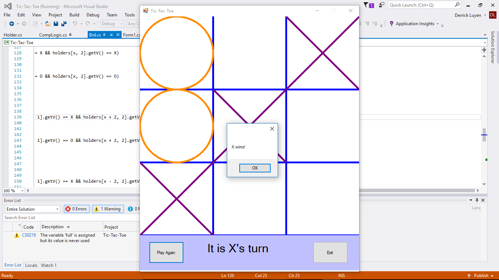

This tic-tac-toe game was something I designed to fulfill my senior project and to learn more about programming in general. I wanted to make a simple game from what I learned about programming and I ended up with tic-tac-toe.

This tic-tac-toe game was implemented using [Microsoft Visual Studio 2010](https://visualstudio.microsoft.com/), and specifically, I used the part of the application that pertained to C#, the language that I designed the game in. Over a course of 30 hours, I planned on how to make the game and then with the help of my mentor, David Stevens, who is a professor at Kapiolani Community College, I was able to successfully program the game. Although the product was nowhere near complete, it was a good start and functioned well enough.

In this project I gained experience with using Microsoft Visual Studio as well as learning about the language C#. I know some things about it now and I look to hopefully learn more about it in the future. I also learned what it was like to make my own game. I know most games would take way longer to develop but I am glad that I at least got a small snippet as to what it was like. 
 

